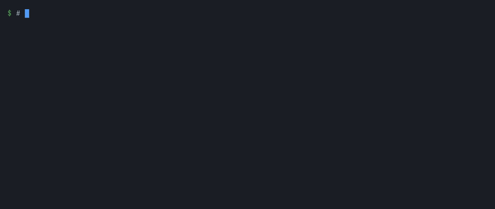

# rowstile: access rules in a policy file, enforced by Postgres

**Authorization inside your Postgres.** Sharing, groups, nested folders and tenants, written in one policy
file and compiled to row-level security. There is no authorization service to run beside the database, and no
permission data to copy into one and keep in step: the rules read the tables your app already has.



Write who-can-do-what in one small file, next to the data it depends on. The `rowstile`
command compiles it into plain SQL: views, trigger-maintained tables for inheritance, row-level
security policies, and functions for app code: checks, sharing, "who has access", "why", access
requests, reviews, audit. Each change to the policy ships as a migration for the tool your app
already uses (Alembic, Prisma, Drizzle Kit, plain SQL). Nothing is installed in the database first,
and nothing has to run next to it: any Postgres 16, 17 or 18 works, managed or not, and the owner of
your tables runs the migrations, no superuser needed.

```authz
app role app_user                               -- the Postgres role the app connects as
type user = app.users
type folder = app.folders
  owner  : user   = owner_id                    -- a relation read from a column
  parent : folder = parent_id
  editor : user   = app.folder_editors(folder_id -> user_id)   -- ... or from a link table
  can edit = owner or editor or parent.edit     -- inherited down the tree
  can view = edit
rules app.folders
  select : view
  update : edit
```

The app says who is asking in each transaction and queries its tables as usual; RLS
filters every read and checks every write:

```sql
BEGIN;
SELECT authz.act_as('user', '42');         -- a trusted backend, or:
-- SELECT authz.login_key('ak_...');       -- an API key (optionally limited by scopes)
-- SELECT authz.login_jwt('eyJ...');       -- a JWT from your identity provider
SELECT * FROM app.folders;                             -- only the folders 42 may view
SELECT authz.can('folder', 7, 'edit');                 -- ask directly
SELECT * FROM authz.perms_of('folder', ARRAY['7', '8']);  -- a list's buttons, in one call
COMMIT;
```

## Is it for you?

It fits when:

- your app's data is in one Postgres database;
- who may see or change a row depends on other rows: its owner, the members of a team (teams inside teams), a
  folder or a project that passes access down, a tenant, what people share with each other;
- you were about to add an authorization service and keep it in step with the database, or your hand-written
  row-level security has become hard to test and to change.

It doesn't when:

- what decides access is in several databases, or outside Postgres;
- a browser reads the tables through Supabase's Data API (its roles are not the app role: a backend has to
  sign in);
- one tree takes many moves and links a second (they wait for each other);
- you need an outside audit or a vendor behind it today: rowstile is a 0.x preview with one maintainer.

## Status

rowstile is a 0.x preview. Until 1.0, a minor release may change the language, the `authz.*` functions, the
SDKs and the file formats; each release still upgrades a database from the one before it, and the changelog
says what to do. [What a 0.x release promises](docs/reference/limits.md#what-a-0x-release-promises).

rowstile was called rowfence until 0.1.0-alpha.1; another product had the name first. The
[changelog](CHANGELOG.md) says what to change.

## Installing

Only an alpha is published so far, 0.1.0-alpha.5: ask for it.

    npm i -D rowstile@next         # the command with its own Python: a TypeScript app needs none
    pip install --pre rowstile     # the command and the Python SDK: rowstile[fastapi], [sqlalchemy], ...
    docker run --rm -u "$(id -u):$(id -g)" -v "$PWD:/work" ghcr.io/rowstile/rowstile:0.1.0-alpha.5 migrate

`npm` brings the Python for Linux (glibc and musl, x64 and arm64), macOS (x64 and arm64) and Windows x64. The
image runs as root unless told otherwise: `-u` makes the files it writes yours. [Installing](docs/installing.md)
has the rest: alphas and release candidates, the extras, the repository.

From this repository, put `core/cli` on `PATH`. `rowstile init` then finds the stack (Next.js, Prisma,
Drizzle, FastAPI, SQLAlchemy, Alembic), writes `rowstile.toml` for its migration tool, adds the SDK's
packages and says which line to change.

## Docs

- [Getting started](docs/getting-started.md): from a schema to a policy, its tests, the edit loop and the
  first migration, in about fifteen minutes.
- [rowstile and the alternatives](docs/comparison.md): authorization services, policy engines, rules in the
  ORM, row-level security by hand; and [how rowstile is checked](docs/how-it-is-checked.md).
- [Your stack](docs/stacks/README.md): FastAPI, Next.js, other Node and Python apps, and the SQL any other
  language sends.
- [Cookbook](docs/cookbook.md), [troubleshooting](docs/troubleshooting.md), [running
  rowstile](docs/operations.md), [managed Postgres](docs/managed-postgres.md) (Neon, Supabase), [files in
  S3-compatible storage](docs/signed-urls.md), [error codes](docs/errors/README.md).
- Reference: [the policy language](docs/reference/language.md), [app code](docs/reference/app-code.md),
  [identity](docs/reference/identity.md), [governance](docs/reference/governance.md),
  [tools](docs/reference/tools.md), [migrations](docs/reference/migrations.md),
  [reviewing a change](docs/reference/review.md), [how it works](docs/reference/guarantees.md),
  [speed and limits](docs/reference/limits.md).
- [The playground](playground/README.md): the compiler and a real Postgres in the browser, nothing installed.

## This repository

| folder | what |
|---|---|
| [`core/`](core/README.md) | the compiler and the `rowstile` command, their tests and the benchmarks |
| `sdk/` | the SDKs: [Python](sdk/python/README.md) (FastAPI, SQLAlchemy, psycopg, asyncpg) and [TypeScript](sdk/typescript/README.md) (Next.js, Prisma, Drizzle, pg, postgres.js, React) |
| [`integrations/`](integrations/README.md) | each SDK's conformance suite: a small app and the checks it must pass |
| [`examples/`](examples/README.md) | complete apps built on rowstile: a file manager and a messenger |
| [`editor/`](editor/README.md) | the VS Code and Zed extensions, a Tree-sitter grammar (Helix, Neovim); other editors start `rowstile lsp` |
| `review-ci/` | the policy review for pull requests: a GitHub action and a GitLab CI template |
| `docs/` | the guides and the reference, as Markdown; `site/` builds them into the docs site |
| [`playground/`](playground/README.md) | rowstile in the browser (Pyodide and PGlite) |
| `packaging/` | how rowstile is installed: npm, PyPI and a Docker image |

## Contributing

A question, or something you built with rowstile: [Discussions](https://github.com/rowstile/rowstile/discussions).
Issues and pull requests are welcome: [CONTRIBUTING.md](CONTRIBUTING.md) says how a change gets in, and
[the code of conduct](CODE_OF_CONDUCT.md) how we work together. What
changed in each release: [CHANGELOG.md](CHANGELOG.md). How releases are numbered and made:
[RELEASING.md](RELEASING.md).

## Security

rowstile has not been audited by anyone outside the project. [The threat model](docs/threat-model.md) says
what it protects and from whom. Report a vulnerability privately: [SECURITY.md](SECURITY.md).

How the project itself is run, as the OpenSSF Scorecard measures it (pinned actions, what each workflow's
token may do, known vulnerabilities in dependencies, review, releases):
[](https://scorecard.dev/viewer/?uri=github.com/rowstile/rowstile)

## License

Apache License 2.0; see [LICENSE](LICENSE). Copyright 2026 Salaheddine EL HSSANI.
