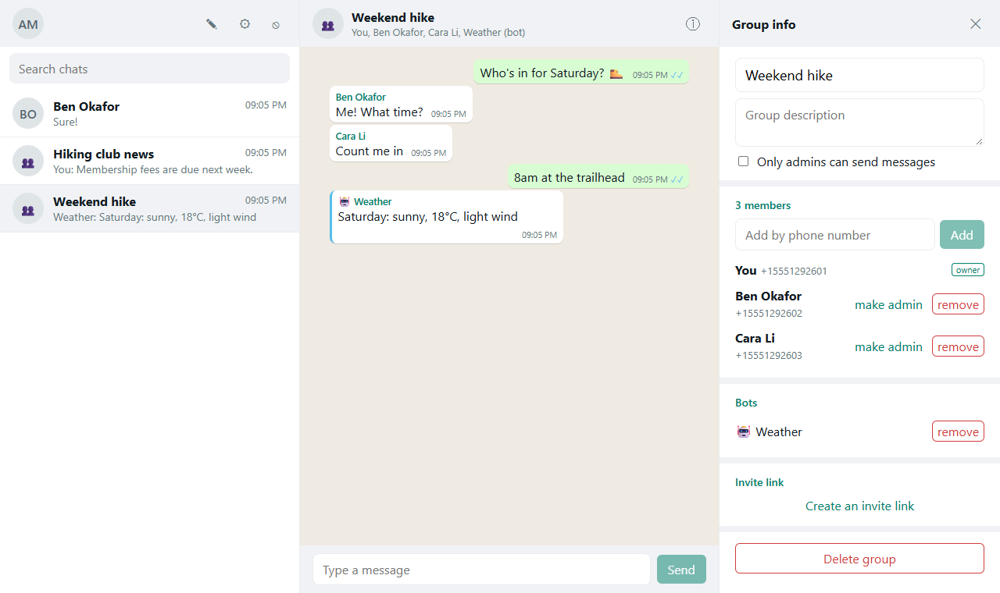
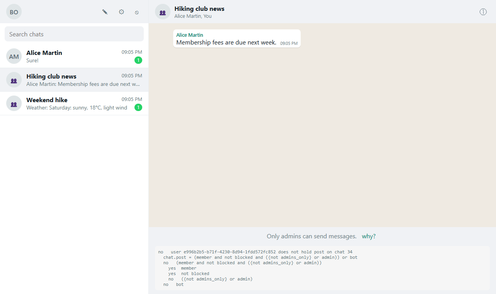

# Messenger

A WhatsApp-style messaging app, built to show what rowstile takes off an application's hands. It has
direct chats and groups, owners and admins, announcement groups, invite links, blocking, message editing
and deleting for everyone, read receipts, bots that post with their own API keys, and live updates.

Every rule about who may do what lives in one file, [`db/policy.authz`](db/policy.authz) (about 100 lines).
rowstile turns it into row-level security on the app's tables. The backend
([`backend/app/main.py`](backend/app/main.py)) has **no permission checks at all**: it signs each
transaction in as the person asking, runs plain SQL, and turns the database's refusals into HTTP errors.





```
docker compose up -d --build          # the app on http://localhost:8001 (Postgres and rowstile, built from this repository)
./test.sh                             # the API tests: the database in Docker, the tests on the host
```

For development: `docker compose up -d db`, then `uv run python ../db/migrate.py` and
`uv run uvicorn app.main:app --port 8001` in `backend/`, and `npm run dev` in `frontend/`. While changing
the policy, `rowstile dev` (with `MS_ADMIN_URL` set; `rowstile.toml` says the rest) applies it on every save,
runs its tests and rewrites the client. The migrations set that database up, so mark it as a development
database once first: `rowstile push --development`.

## The rules, and where they are

| What the app does | How the policy says it |
|---|---|
| Only members read a chat | `can read = member or bot`, and `rules ms.messages select : read` |
| New members don't see what was said before they joined | `message.read = chat.read and {seq > coalesce(ms.joined_seq(chat_id), 0)}` (by the message's number: a clock that steps back refuses nothing) |
| Owners and admins manage a group | `admin : user = ms.members(chat_id -> user_id) where {role in ('admin', 'owner')}`, `can manage = admin and {kind = 'group'}` |
| Announcement groups: only admins post | `can post = (member and not blocked and ({not admins_only} or admin)) or bot` |
| Blocking: neither can write to the other in their direct chat | `blocked : user = ms.direct_blocks(chat_id -> user_id)`, and `not blocked` in `post` |
| ...and someone who blocked you can't be added to a chat with you | `rules ms.members insert : ... and not person.has_blocked` |
| A direct chat stays two people | `add_members = ... or (creator and {kind = 'direct'} and {(select count(*) ...) < 2})` |
| Nobody demotes or removes the owner, nor makes another | `update role : chat.manage and {role <> 'owner'}`, `update role after : {role <> 'owner'}` |
| Edit your own messages for 15 minutes | `can edit = sender and {not deleted and created_at > now() - interval '15 minutes'}` |
| Delete for everyone: yours, or anyone's if you're an admin; no undelete | `can remove = sender or chat.manage`, `update deleted after : {deleted}` |
| Invite links anyone can use for a week | `invitee : link shared by invite`, `can join = invitee and {kind = 'group'}`; the backend calls `authz.create_link`, and `authz.list_links` and `authz.revoke_link` so admins see the links and turn one off |
| Bots post as themselves, only where an admin added them | `type bot = ms.bots principal where {active}`, `bot : bot = ms.chat_bots(...)`, `from_bot` in the insert rule |
| Only a bot's owner makes its keys | `can manage_keys = owner` on the bot type; the backend calls `authz.create_api_key(..., 'bot', id)` |
| Messages are numbered per chat | `type message = ms.messages (chat_id, seq)`: a composite key; the API asks `authz.can('message', '(7,42)', 'edit')` |

Each row of this table is a test in [`db/tests/rules.authz`](db/tests/rules.authz): it makes the people and
chats it needs, checks who may do what (as the app, through row-level security), and rolls back. `rowstile
test` runs them: 45 checks, in about a second.

## What the backend doesn't have to do

- **No checks before queries.** `POST /api/chats/{id}/messages` is an `INSERT`. If you may not post
  there (not a member, blocked, an announcement group), row-level security refuses it, and the API
  answers 403.
- **No filtering after queries.** `GET /api/chats` is a join of `ms.chats` and your membership row; it
  returns only the chats you may read. A chat you're not in answers 404, as if it didn't exist.
- **No "why can't I?" logic.** When the database refuses a write, its error says which rule refused it and
  what is missing. The API passes that on (`refusal(error)` from the generated client), and an update that
  changed nothing asks for the same (`authz.expect`). The web app shows it behind a "why?" link:

  ```
  no   insert : chat.post and ((sender and {bot_id is null}) or (from_bot and {sender_id is null}))  (line 95)
    no   chat.post
      no   user 5cf5… does not hold post on chat 16
        chat.post = (member and not blocked and ({not admins_only} or admin)) or bot
        no   (member and not blocked and ({not admins_only} or admin))
          yes  member
          yes  not blocked
          no   ({not admins_only} or admin)
        no   bot
    yes  ((sender and {bot_id is null}) or (from_bot and {sender_id is null}))
  ```
- **No permission model in the UI.** The chat's `perms` come from `authz.perms`, and buttons show or hide
  by them. The database checks again when you press them.
- **No bot authentication.** A bot sends `Authorization: Bearer ak_...`; the backend calls
  `authz.login_key`, and the database knows which bot it is (`authz.principal()`).
- **Live updates that can't leak.** A trigger announces "chat N changed"
  (`NOTIFY ms_events`). The backend asks the database once which of the connected people may read chat N
  (`authz.who_among`), and only then passes the number on. The browser refetches through the API, which row-level
  security filters. A WebSocket never carries a message.

## What rowstile caught while building it

- **`authz.lint()` flagged the blocking view.** The view `ms.direct_blocks` was readable by the app role,
  and views run with their owner's rights, so they bypass row-level security. The migration now revokes it:
  only the policy reads it.
- **Rule conditions run as the app role.** "Never add someone who blocked you" first read `ms.blocks` in
  a `{condition}`. It saw nothing, because a person may only see their own blocks. As a relation
  (`has_blocked`, followed with `person.has_blocked`), the policy reads it with its own rights.
- **The plain `update` rule holds before and after the change.** "Deleted for everyone" made the message
  fail `remove` if `remove` required "not deleted yet". So `remove` doesn't; `update deleted after :
  {deleted}` forbids undeleting.

## Layout

- `db/migrations/` the tables (plain data integrity), `db/policy.authz` the rules, `db/migrate.py` applies
  both and writes the generated client (`backend/app/authz_client.py`, from `rowstile client py`)
- `backend/` FastAPI: `main.py` the API, `db.py` transactions signed in as a person or a bot, `auth.py`
  passwords and sessions, `events.py` live updates, `tests/test_api.py`
- `frontend/` React: the chat list, conversations, group info, settings (profile, bots, blocked people)
- `check_public_surface.py`: the app uses only rowstile's public functions, never its internals
